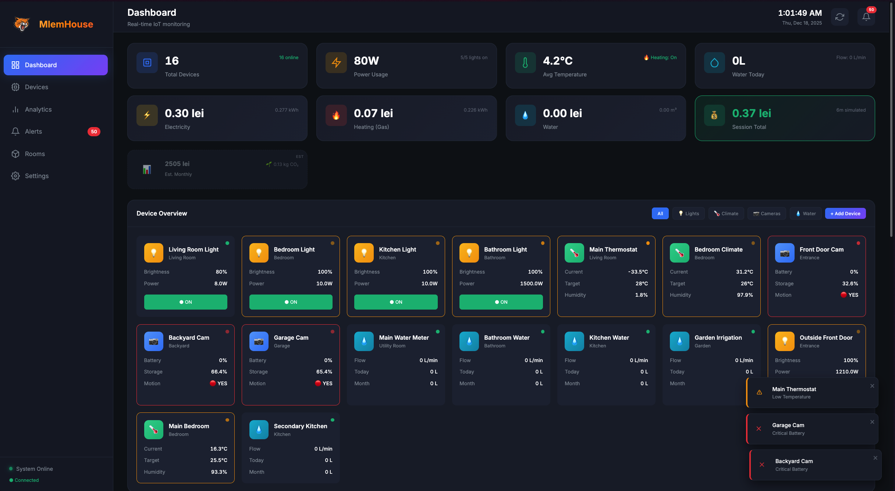
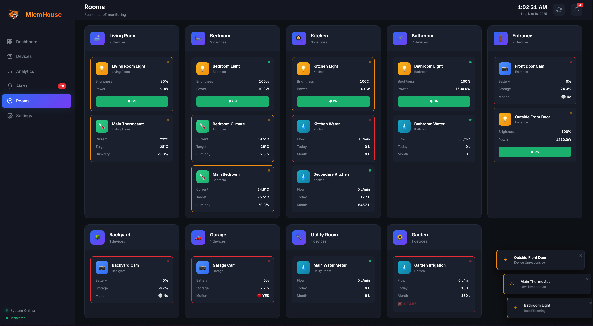
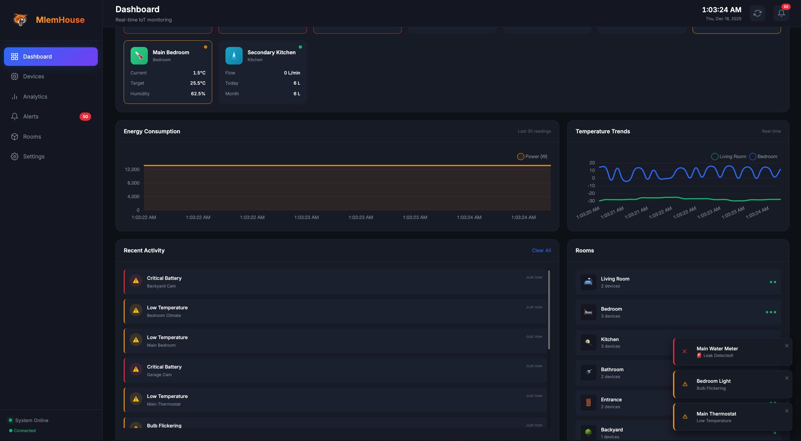

<div align="center">
  
  
  # MlemHouse
  ### *Smart IoT Device Manager & Analytics Dashboard* 🏠
  
  [](https://www.python.org/)
  [](https://fastapi.tiangolo.com/)
  [](https://docs.python.org/3/library/asyncio.html)
  [](https://developer.mozilla.org/en-US/docs/Web/API/WebSockets_API)
  [](LICENSE)
</div>

<p align="center">
  <i>A comprehensive IoT simulation platform featuring real-time device monitoring, energy analytics, and cost tracking for smart home management.</i>
</p>

---

## ✨ Overview

**MlemHouse** is a full-stack IoT device management system that simulates and monitors smart home devices in real-time. Built with Python's async capabilities, it demonstrates advanced concepts in OOP, concurrent programming, functional data processing, and modern web technologies.

The dashboard provides live monitoring of smart bulbs, thermostats, cameras, and water meters with accurate utility cost calculations based on Romanian (Timișoara) rates.

## 📸 Screenshots

<div align="center">

### 🏠 Main Dashboard

<p><i>Real-time overview with device stats, energy consumption, and utility costs</i></p>

### 🚪 Room Management

<p><i>Organize and monitor devices by room with intuitive controls</i></p>

### 📊 Analytics & Graphs

<p><i>Real-time statistics and historical data visualization</i></p>

</div>

## 🌟 Features

### Device Management
- **💡 Smart Bulbs** - Control brightness, power states, and track energy consumption
- **🌡️ Smart Thermostats** - Monitor temperature, humidity, and heating/cooling modes
- **📷 Smart Cameras** - Battery levels, motion detection, and storage management
- **💧 Water Meters** - Flow rates, daily/monthly usage, and leak detection

### Real-Time Monitoring
- **⚡ Live Updates** - WebSocket-powered instant device state changes
- **📈 Energy Tracking** - Electricity (kWh), Gas (kWh), and Water (m³) consumption
- **💰 Cost Calculations** - Accurate utility costs in Romanian Lei (RON)
- **🌱 Carbon Footprint** - Environmental impact tracking

### Advanced Features
- **⏱️ Time Simulation** - Fast-forward time (1x to 1440x) to observe consumption patterns
- **🔧 Device Configuration** - Customize wattage and power settings per device
- **📝 Persistent Storage** - JSON-based device configuration with history logging
- **🚨 Smart Alerts** - Real-time notifications for issues (low battery, leaks, weak signal)

## 🏗️ Architecture

The project demonstrates four core programming paradigms:

| Module | Paradigm | Implementation |
|--------|----------|----------------|
| **Device Layer** | OOP & Abstraction | Abstract `SmartDevice` class with concrete implementations |
| **Network Simulation** | AsyncIO | Concurrent device updates using `TaskGroup` and `create_task` |
| **Analytics Engine** | Functional Programming | Data pipelines with `map`, `filter`, `reduce` |
| **Storage System** | Threading | Non-blocking I/O with daemon thread and `Queue` |

## 📋 Requirements

- Python 3.10 or higher
- Modern web browser (Chrome, Firefox, Safari, Edge)

## 🚀 Installation

1. **Clone the repository:**
   ```bash
   git clone https://github.com/yourusername/mlemhouse.git
   cd mlemhouse
   ```

2. **Create and activate virtual environment:**
   ```bash
   python3 -m venv venv
   source venv/bin/activate  # On Windows: venv\Scripts\activate
   ```

3. **Install dependencies:**
   ```bash
   pip install -r requirements.txt
   ```

4. **Run the application:**
   ```bash
   python server.py
   ```

5. **Open your browser:**
   ```
   http://localhost:8000
   ```

## 📁 Project Structure

```
mlemhouse/
├── server.py              # FastAPI application & WebSocket server
├── devices.py             # Smart device classes (OOP layer)
├── network.py             # AsyncIO network simulation
├── analytics.py           # Functional data processing
├── storage.py             # Threaded storage worker
├── config.py              # Utility rates & configuration
├── devices.json           # Persistent device storage
├── history.log            # Device activity log
├── requirements.txt       # Python dependencies
├── static/
│   ├── css/
│   │   └── dashboard.css  # Dashboard styling
│   ├── js/
│   │   └── dashboard.js   # Frontend logic & WebSocket client
│   └── img/               # Images and icons
└── templates/
    └── dashboard.html     # Main dashboard template
```

## 📱 Usage

### Dashboard Navigation

| View | Description |
|------|-------------|
| **Dashboard** | Main overview with stats, costs, and device grid |
| **Devices** | Detailed device table with filtering |
| **Analytics** | Real-time charts and historical data |
| **Alerts** | Notification center for device issues |
| **Rooms** | Room-based device organization |
| **Settings** | Configuration and experimental features |

### Device Controls

1. **Click any device card** to open the control modal
2. **Adjust settings** like brightness, temperature targets, or valve states
3. **Configure power settings** (watts) in the device configuration section
4. **Delete devices** or add new ones via the "+ Add Device" button

### Time Simulation (Experimental)

1. Go to **Settings** → Enable **Experimental Features**
2. Select a time multiplier:
   - `1x` - Real-time
   - `60x` - 1 second = 1 minute
   - `360x` - 10 seconds = 1 hour
   - `1440x` - 1 minute = 1 day
3. Watch costs and consumption accumulate faster!

## ⚡ Utility Rates (Romania/Timișoara)

| Utility | Rate | Unit |
|---------|------|------|
| Electricity | 1.10 lei | per kWh |
| Gas (Heating) | 0.31 lei | per kWh |
| Water + Sewage | 12.21 lei | per m³ |

## 🔮 Future Improvements

- [ ] Add database backend (PostgreSQL/MongoDB)
- [ ] Implement user authentication
- [ ] Mobile-responsive design improvements
- [ ] Historical data export (CSV/JSON)
- [ ] Custom automation rules
- [ ] Integration with real IoT protocols (MQTT, Zigbee)
- [ ] Multi-language support

## 🛠️ Technical Highlights

- **Async/Await** - Non-blocking concurrent device simulation
- **WebSockets** - Bidirectional real-time communication
- **Functional Pipelines** - `functools.reduce` for metrics calculation
- **Thread Safety** - Queue-based communication between async and threaded code
- **Type Hints** - Full typing support for better code maintainability

## 📄 License

This project is licensed under the MIT License - see the [LICENSE](LICENSE) file for details.

## 💙 Acknowledgments

- FastAPI for the excellent async web framework
- Chart.js for beautiful data visualization
- The Python community for async/await patterns and best practices

---

<p align="center">
  <i>Construit cu pasiune</i> 🧡 <i>(Built with passion)</i>
</p>
